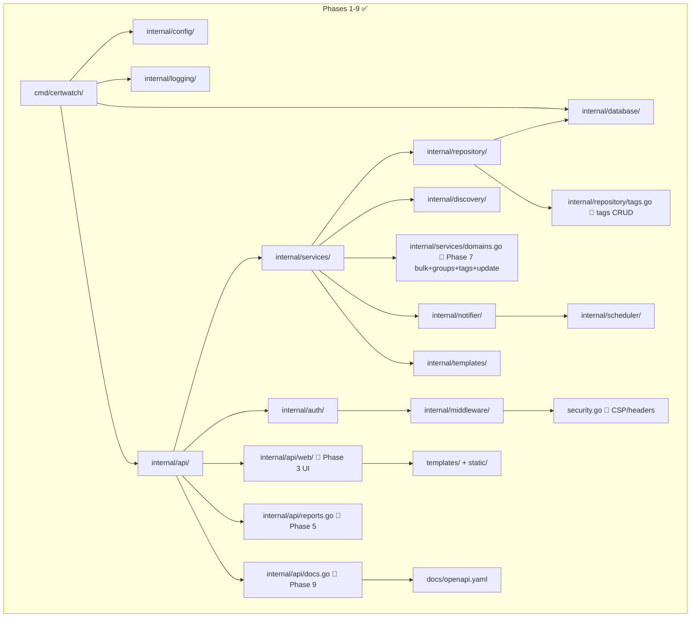

# Architecture

> Phase: 9 · Status: Updated — OpenAPI docs, Scalar UI

## Pattern
Clean architecture with dependency injection. Layer boundaries enforced by Go package imports — outer layers depend on inner layers, never the reverse.

## Layers (inner → outer)

| Layer | Package | Phase | Dependencies |
|-------|---------|-------|--------------|
| Config | `internal/config/` | 1 ✅ | None |
| Logging | `internal/logging/` | 1 ✅ | None |
| Database | `internal/database/` | 1 ✅ | None |
| Models | `internal/models/` | 2 ✅ | None (standalone types) |
| Repository | `internal/repository/` | 2 ✅ | `internal/models`, `internal/database` |
| Tags Repository | `internal/repository/tags.go` | 7 ✅ | `internal/models`, `internal/database` |
| Templates | `internal/templates/` | 4 ✅ | None |
| Scheduler | `internal/scheduler/` | 4 ✅ | None |
| Notifier | `internal/notifier/` | 4 ✅ | `internal/config`, `internal/templates`, `internal/models` |
| Discovery | `internal/discovery/` | 2 ✅ | `internal/models` |
| Auth | `internal/auth/` | 2 ✅ | None |
| Middleware | `internal/middleware/` | 2 ✅ | `internal/auth` |
| Security Headers | `internal/middleware/security.go` | 7 ✅ | None |
| Services | `internal/services/` | 2 ✅ | `internal/repository`, `internal/models`, `internal/auth`, `internal/discovery` |
| API | `internal/api/` | 2 ✅ | `internal/services`, `internal/middleware` |
| Web UI | `internal/api/web/` | 3 ✅ | `internal/services` (domain detail) |
| Reports | `internal/api/reports.go` | 5 ✅ | `internal/services` |
| Entrypoint | `cmd/certwatch/` | 1 ✅ | All internal packages, config loader |

## Scanner design

Scanners are registered in `main.go` and tried sequentially in priority order:

1. **HTTPS** (5s timeout) — SNI-aware TLS handshake, most likely to succeed
2. **CT** (10s timeout) — Certificate Transparency log query via crt.sh
3. **SMTP / IMAP / POP3 / LDAP / FTP / TLS** (2s each) — protocol stubs

First scanner to return a valid certificate wins. If all fail, an "error" cert with `protocol=unknown` is created.

## Tags & Groups

- **Groups**: simple text field (`group_name` column on `domains` table). Set on create or update. Not a separate table.
- **Tags**: M:N relationship via `tags` and `domain_tags` tables with CASCADE deletes.
  - Tags have `name` and `color` fields — color is randomly assigned from a 10-color palette on first use.
  - `SetDomainTags` in `internal/repository/tags.go` replaces all tags for a domain with the given names (creates missing tags).
  - Tags are returned as `tags` array on every domain GET/list response.

## Security

Middleware chain in `cmd/certwatch/main.go`:

1. **Recovery** — panic recovery → 500
2. **Logging** — method/path/status/duration logging
3. **SecurityHeaders** — CSP, X-Frame-Options: DENY, X-Content-Type-Options: nosniff, X-XSS-Protection: 0, Referrer-Policy
4. **CORS** — configurable allowed origins (default: `http://localhost:8080`). No origin header → no `Access-Control-Allow-Origin` set. Disallowed origins → no header.

Additional security:
- Password minimum 8 characters (`internal/services/auth.go`)
- Input length limits: description ≤500, group ≤100
- Registration errors are generic ("registration failed") — no email enumeration
- User timestamps re-fetched after creation (was returning zero values)
- Bulk import always returns 200 (was returning 400 on individual errors)

## Conventions
- `internal/` packages are never imported from outside the module
- Each discovery protocol gets its own scanner type registered in the discovery registry
- Configuration loaded once at startup via `internal/config/` and passed via DI
- Notification profiles loaded from YAML config, validated, and scheduled via cron
- Reports combine domain + certificate data in-memory from existing repository methods
