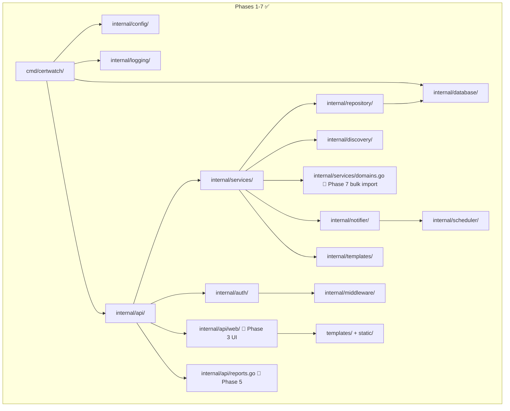

# Architecture

> Phase: 7 · Status: Updated — Backup/restore scripts, bulk import added

## Pattern
Clean architecture with dependency injection. Layer boundaries enforced by Go package imports — outer layers depend on inner layers, never the reverse.

## Layers (inner → outer)

| Layer | Package | Phase | Dependencies |
|-------|---------|-------|--------------|
| Config | `internal/config/` | 1 ✅ | None |
| Logging | `internal/logging/` | 1 ✅ | None |
| Database | `internal/database/` | 1 ✅ | None |
| Models | `internal/models/` | 2 ✅ | None (standalone types) |
| Repository | `internal/repository/` | 2 ✅ | `internal/models`, `internal/database` |
| Templates | `internal/templates/` | 4 ✅ | None |
| Scheduler | `internal/scheduler/` | 4 ✅ | None |
| Notifier | `internal/notifier/` | 4 ✅ | `internal/config`, `internal/templates`, `internal/models` |
| Discovery | `internal/discovery/` | 2 ✅ | `internal/models` |
| Auth | `internal/auth/` | 2 ✅ | None |
| Middleware | `internal/middleware/` | 2 ✅ | `internal/auth` |
| Services | `internal/services/` | 2 ✅ | `internal/repository`, `internal/models`, `internal/auth`, `internal/discovery` |
| API | `internal/api/` | 2 ✅ | `internal/services`, `internal/middleware` |
| Web UI | `internal/api/web/` | 3 ✅ | `internal/services` (domain detail) |
| Reports | `internal/api/reports.go` | 5 ✅ | `internal/services` |
| Entrypoint | `cmd/certwatch/` | 1 ✅ | All internal packages, config loader |

## Scanner design

Scanners are registered in `main.go` and tried sequentially in priority order:

1. **HTTPS** (5s timeout) — SNI-aware TLS handshake, most likely to succeed
2. **CT** (10s timeout) — Certificate Transparency log query via crt.sh
3. **SMTP / IMAP / POP3 / LDAP / FTP / TLS** (2s each) — protocol stubs

First scanner to return a valid certificate wins. If all fail, an "error" cert with `protocol=unknown` is created.

## Conventions
- `internal/` packages are never imported from outside the module
- Each discovery protocol gets its own scanner type registered in the discovery registry
- Configuration loaded once at startup via `internal/config/` and passed via DI
- Notification profiles loaded from YAML config, validated, and scheduled via cron
- Reports combine domain + certificate data in-memory from existing repository methods
