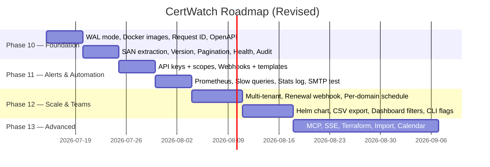

# CertWatch Roadmap

> Planned improvements organized by phase. All changes are backward-compatible.
>
> This roadmap was reviewed by a senior developer. Items marked **removed** were cut
> (not valuable enough), items marked **promoted** were moved earlier (higher impact),
> and new items address critical gaps in the current product.

**Legend:** ⬜ Planned · 🔄 In progress · ✅ Done

---

## Changes from previous version

| Change | Reason |
|--------|--------|
| PostgreSQL → ❌ removed | SQLite + WAL handles this workload; dialect abstraction touches every file for marginal benefit |
| JSON-LD → ❌ removed | No downstream consumer exists; Schema.org has no certificate types |
| Semantic Search (FTS5) → ❌ removed | Existing `?q=` LIKE search covers 95% of use cases; FTS5 locks out non-SQLite backends |
| MCP Server → demoted to Phase 13 | Protocol is bleeding-edge (Nov 2024); HTTP API + OpenAPI serves AI tools today |
| Runtime log level → removed | SIGHUP doesn't work in containers; low value for implementation cost |
| cobra CLI → simplified | Use flags (`-list-domains`), not a subcommand framework — avoids 10+ transitive deps in scratch binary |
| Pre-built Docker → promoted to Phase 10 | Trivial CI workflow; immediate user value |
| Request ID tracing → promoted to Phase 10 | Highest-ROI observability improvement; ~40 lines of code |
| OpenAPI enrichment → promoted to Phase 10 | Pure YAML changes; enables AI tooling immediately |
| **SAN extraction** → **added** (Phase 10) | #1 data gap — cert model has no Subject Alternative Names |
| **WAL mode** → **added** (Phase 10) | One `PRAGMA` in `Open()`; solves concurrent read performance at zero cost |
| **Multi-tenant** → **added** (Phase 12) | Every user shares every domain — blocks org adoption |
| **Renewal webhook** → **added** (Phase 12) | Natural next step after expiry detection: trigger ACME/renewal |
| **Integration templates** → **added** (Phase 11) | Pre-built Slack/Discord/Teams payloads reduce time-to-value |
| **Expiry calendar/timeline** → **added** (Phase 13) | Visual calendar >> sorted table for UX |
| **SMTP test endpoint** → **added** (Phase 11) | Verify notification config without waiting for a real alert |
| **Terraform provider** → **added** (Phase 13) | Manage domains as infrastructure |
| **External source import** → **added** (Phase 13) | Import from certbot, K8s secrets, AWS ACM |

---

## Phase 10 — Foundation

**Goal:** Production readiness, observability, basic API completeness.

### 10.1 WAL mode

**Why:** One-line change with immediate performance impact. Enables concurrent reads during background scans without blocking.

- Add `PRAGMA journal_mode=WAL` in `database.Open()` after the initial ping
- Document that SQLite is the supported database and WAL mode is enabled by default

### 10.2 Pre-built Docker images

**Why:** Users should `docker pull` not `git clone && make`.

- GitHub Actions workflow `.github/workflows/docker-publish.yml`:
  - Trigger: push to `main` + tags (`v*`)
  - Multi-arch build: `linux/amd64`, `linux/arm64`
  - Tags: `latest`, `v0.1.0`, `sha-<short>`
  - Push to `ghcr.io/araujofrancisco/certwatch`
  - Labels: commit SHA, build date, Go version
- Update `README.md` deployment section with pull command

### 10.3 Request ID tracing

**Why:** Without correlatable IDs, debugging production issues means grepping unstructured logs. This is the highest-ROI observability change.

- New file `internal/middleware/requestid.go`:
  - Generate unique `request_id` per request (nanoid, 12 chars: `cw_a1b2c3d4`)
  - Store in request context
  - Add to every log line via `slog.With("request_id", id)`
- Middleware wraps the handler chain, sets `X-Request-ID` response header

### 10.4 OpenAPI enrichment

**Why:** AI tooling (LangChain, OpenAI function calling) relies on clean OpenAPI specs. Missing `operationId` and examples make auto-generated clients unreliable.

- Add `operationId` to every path (e.g. `operationId: listDomains`)
- Full `description` + `example` on all parameters
- `x-openai-isConsequential: false` on read-only endpoints
- Consistent error responses (400/401/404/500) across all paths
- Example values for every request/response schema

**Pure YAML changes — no Go code.**

### 10.5 SAN extraction

**Why:** The #1 missing data point. `Certificate` has `Subject` and `Issuer` but no SANs. Users need to know which domains a cert covers.

- Add `SubjectAlternativeNames` field to `models.Certificate`:
  ```go
  SubjectAlternativeNames []string `json:"sans,omitempty"`
  ```
- Persist as JSON array in the `certificates` table (new column `sans TEXT`)
- Extract from `x509.Certificate.DNSNames` + `IPAddresses` in the HTTPS scanner (`internal/discovery/https/`)
- Include in list/get certificate API responses
- Display in web UI certificate detail (add SAN list below subject/issuer)

### 10.6 Version endpoint

**Why:** Automation scripts need to check API compatibility.

- `GET /api/version` → `{"version": "0.1.0", "build": "<commit-sha>"}`
- No auth required (same as `/health`)
- Version injected via `-ldflags="-X main.version=$(git describe --tags --always)"` in Makefile

### 10.7 Pagination + sorting

**Why:** Current list endpoints return all results unbounded. A user with 10k domains gets a single 10 MB JSON response.

- Query params: `?limit=50&offset=0` (max 1000, default 100)
- `?sort_by=not_after&order=asc` with whitelist of allowed columns:
  - Domains: `domain`, `created_at`, `updated_at`, `group`, `enabled`
  - Certs: `not_after`, `not_before`, `last_checked`, `created_at`, `status`, `protocol`
- Response: `X-Total-Count` header + `Link` header (RFC 8288)
- Repository layer: filter structs gain `Limit`, `Offset`, `SortBy`, `SortOrder`

### 10.8 Detailed health endpoint

**Why:** Load balancers and operators need more than `{"status":"ok"}`.

```json
{
  "status": "ok",
  "db": "ok",
  "version": "0.1.0",
  "uptime_seconds": 3600,
  "certificates": { "total": 142, "valid": 130, "expiring_30d": 5, "expired": 3, "errors": 4 },
  "domains": { "total": 50, "enabled": 48 },
  "last_scan": "2026-07-07T12:00:00Z"
}
```

### 10.9 Audit log

**Why:** Security compliance requires knowing who did what and when.

- New `audit` boolean field in structured log output: `"audit": true`
- Events logged: user registration, login (with IP), failed auth, domain deletion, token validation failures
- Filterable with `jq 'select(.audit==true)'`
- Wrapper function in `internal/logging/audit.go`:
  ```go
  func Audit(ctx context.Context, event string, attrs ...slog.Attr) {
      slog.With("audit", true).LogAttrs(ctx, slog.LevelInfo, event, attrs...)
  }
  ```

---

## Phase 11 — Alerts & Automation

**Goal:** Reliable alerting, API-first automation, production monitoring.

### 11.1 API keys with scopes

**Why:** JWT tokens expire (24h default). Automation and CI/CD need static credentials. Scopes prevent privilege escalation.

- New table `api_keys` with bcrypt-hashed keys, optional expiry, `last_used_at`, `scope`:
  ```sql
  CREATE TABLE api_keys (
    id INTEGER PRIMARY KEY AUTOINCREMENT,
    user_id INTEGER NOT NULL REFERENCES users(id) ON DELETE CASCADE,
    name TEXT NOT NULL,
    key_hash TEXT NOT NULL,
    prefix TEXT NOT NULL,
    scope TEXT NOT NULL DEFAULT 'read',  -- 'read' | 'write' | 'admin'
    expires_at DATETIME,
    last_used_at DATETIME,
    created_at DATETIME DEFAULT CURRENT_TIMESTAMP
  );
  ```
- `POST /api/api-keys` — generates `cw_` + 40-char hex, returns plaintext once
- `DELETE /api/api-keys/{id}` — revoke
- `GET /api/api-keys` — list (prefix + name + scope, never hash)
- Auth middleware tries JWT first, falls back to API key (`Authorization: Bearer` or `X-API-Key` header)
- Scope enforcement: `read` = GET only, `write` = POST/PUT/DELETE on domains/certs, `admin` = everything including API key management

### 11.2 Webhook notifications + integration templates

**Why:** ChatOps is the standard. Generic webhooks are flexible; pre-built templates make them instant.

- New profile type `type: webhook`:
  ```yaml
  profiles:
    - name: Ops Slack
      type: webhook
      url: "https://hooks.slack.com/services/..."
      secret: "hmac-secret"
      thresholds: [30, 14, 7]
      headers:
        X-Custom: value
      template: |
        {"text": "⚠️ *{{ .Domain }}* cert expires in *{{ .Threshold }} days*\nIssuer: {{ .Issuer }}\nExpires: {{ .Expires }}"}
  ```
- `internal/notifier/webhook.go`: POST JSON to URL, optional HMAC-SHA256 in `X-Signature-256`, 10s timeout, optional retry (up to 3 with 5s backoff)
- **Integration templates** documented in `docs/guide/notifications.md`:
  - Slack: formatted message with color blocks
  - Discord: embedded message with fields
  - Teams: Adaptive Card JSON
  - PagerDuty: PD-CEF format payload
- Events: `cert_discovered`, `cert_expiring`, `cert_expired`, `scan_complete`, `scan_error`

### 11.3 Prometheus metrics

**Why:** Every production service exposes `/metrics`. Without it, operators have no visibility.

- Add `github.com/prometheus/client_golang/prometheus` and `promhttp`
- New package `internal/metrics/metrics.go`:
  ```go
  CertTotal      = promauto.NewGauge(prometheus.GaugeOpts{Name: "certwatch_certificates_total", Help: "Total certificates"})
  DomainTotal    = promauto.NewGauge(prometheus.GaugeOpts{Name: "certwatch_domains_total", Help: "Total domains"})
  ScanDuration   = promauto.NewHistogram(prometheus.HistogramOpts{Name: "certwatch_scan_duration_seconds", ...})
  ScanErrors     = promauto.NewCounter(prometheus.CounterOpts{Name: "certwatch_scan_errors_total", ...})
  ExpiringCerts  = promauto.NewGaugeVec(prometheus.GaugeOpts{Name: "certwatch_certificates_expiring_total"}, []string{"threshold"})
  ```
- `GET /metrics` endpoint
- Metrics updated after each scan and on startup

### 11.4 Slow query logging

**Why:** Diagnose performance issues without external APM.

- Config: `database.slow_query_threshold: "200ms"` (YAML) or `CERTWATCH_DATABASE_SLOW_QUERY_THRESHOLD` env var
- Wrapped `db.Exec` / `db.Query` / `db.QueryRow` in `internal/database/database.go` that times queries and logs if exceeded
- Zero value (0 or empty) disables
- Log format: `"slow query: duration=342ms sql=SELECT * FROM certificates WHERE domain_id=? params=[1]"`

### 11.5 Periodic stats log

**Why:** One log line per hour gives operators a pulse without Prometheus.

- Background goroutine in `cmd/certwatch/main.go`:
  ```go
  slog.Info("service stats",
      "domains_total", domainCount,
      "domains_enabled", enabledCount,
      "certificates_total", certCount,
      "expiring_30d", expiring30,
      "expired", expired,
      "errors", errorCerts,
      "uptime", time.Since(startTime).Round(time.Second))
  ```
- Interval configurable via `logging.stats_interval` (default 1h)

### 11.6 SMTP test endpoint

**Why:** Users should verify notification configuration without waiting for a real expiry event.

- `POST /api/test-notification` (auth required):
  ```json
  {"recipient": "ops@example.com", "profile": "Operations"}
  ```
- Sends a test email with known content: "This is a test notification from CertWatch. Your SMTP configuration is working correctly."
- Returns `{"status": "sent"}` or appropriate error
- Also supports `"via": "webhook"` for webhook profiles

---

## Phase 12 — Scale & Teams

**Goal:** Multi-user, production deployment automation, complete data pipeline.

### 12.1 Multi-tenant / team scoping

**Why:** Every user currently shares every domain. Blocks any org with >1 person.

- Add `user_id INTEGER NOT NULL REFERENCES users(id)` to `domains` table
- All domain routes filter by `user_id` from the authenticated user
- API routes add ownership checks:
  - `GET /api/domains` → `WHERE user_id = ?`
  - `GET /api/domains/{id}` → verify ownership before returning
  - `PUT/DELETE /api/domains/{id}` → verify ownership
- Admin users (identified by scope in API key or a new `is_admin` field on users table) bypass ownership checks
- `POST /api/domains` sets `user_id` from token
- UI shows only user's domains
- Migration: existing domains get assigned to the first registered user (admin) to avoid data loss

### 12.2 Certificate renewal webhook

**Why:** Detection without remediation is noise. The natural next step after "cert is expiring" is "trigger renewal."

- New optional notification profile field: `renewal_url`
  ```yaml
  profiles:
    - name: Auto-Renew
      type: webhook
      url: "https://acme-server.example.com/renew"
      renewal_url: "https://acme-server.example.com/renew?domain={{ .Domain }}"
      thresholds: [7]  # only fire on the 7-day threshold
  ```
- When a cert matches an expiry threshold AND `renewal_url` is configured, POST to `renewal_url` before sending the alert
- Payload:
  ```json
  {
    "event": "cert_expiring",
    "domain": "example.com",
    "certificate_id": 42,
    "serial": "00:ab:cd:...",
    "expires_at": "2026-08-07T00:00:00Z",
    "threshold": 7
  }
  ```
- ACME/cert-manager integration documented in usage guide

### 12.3 Per-domain scan scheduling

**Why:** `discovery.scan_interval` is global. Some domains need hourly scanning (fintech), others weekly (static sites).

- Add optional `scan_interval` field to `POST /api/domains` and `PUT /api/domains/{id}`:
  ```json
  {"domain": "example.com", "scan_interval": "1h"}
  ```
- Defaults to the global `discovery.scan_interval` if not set
- Background scanner respects per-domain interval (checks `updated_at + domain.scan_interval` before scanning)
- New column `scan_interval TEXT NOT NULL DEFAULT ''` on `domains` table

### 12.4 Helm chart

**Why:** K8s teams deploy everything via Helm.

```
deploy/helm/certwatch/
├── Chart.yaml
├── values.yaml
├── templates/
│   ├── deployment.yaml   — configurable replicas, resources, probes
│   ├── service.yaml      — ClusterIP, optional LoadBalancer
│   ├── ingress.yaml      — host, TLS, annotations
│   ├── configmap.yaml    — config/default.yaml from values
│   ├── secret.yaml       — JWT secret (from values or generated)
│   ├── pvc.yaml          — for SQLite data
│   └── hpa.yaml          — optional autoscaling
└── README.md
```

### 12.5 Server-side CSV export

**Why:** API consumers should download CSV without client-side conversion.

- `GET /api/domains/export?format=csv&q=...&enabled=...`
- `GET /api/certificates/export?format=csv&status=expiring&expiring=30`
- Uses Go `encoding/csv`, streams response (`Content-Type: text/csv`)
- Same filter params as list endpoints

### 12.6 Dashboard filter UX

**Why:** Group and tag filters are client-side only. Users expect server-side filtering.

- Add `?group=` and `?tags=` query params to `GET /api/domains`
  - Group: exact match (or IS NULL for empty)
  - Tags: AND logic — domains must have ALL specified tags
- UI dropdowns for group and tags on domains and certificates pages
- Update `DomainFilter` with `Group` and `Tags` fields

### 12.7 Flag-based CLI

**Why:** Simple scripting without HTTP boilerplate, without adding cobra's dependency tree.

- Extend `main()` flag handling:
  ```
  certwatch                    → starts server (current behavior)
  certwatch -list-domains      → queries DB, prints table via tabwriter
  certwatch -list-certs        → same
  certwatch -scan 1            → scans domain ID 1, prints result
  certwatch -export            → CSV export to stdout
  certwatch -version           → prints version
  ```
- Each flag opens its own DB connection, creates its own service instances, and exits
- No dependencies added — just `flag` stdlib and existing service/repository layers
- Table output aligned with `text/tabwriter`

---

## Phase 13 — Advanced / Experimental

**Goal:** Ecosystem plays, novel integrations, long-term differentiators.

### 13.1 MCP server

**Goal:** AI coding assistants query certs directly from the editor.

- `certwatch -mcp` — JSON-RPC 2.0 over stdio (Model Context Protocol)
- Tools: `list_domains`, `list_certificates`, `scan_domain`, `get_inventory_report`, `get_certificate`, `purge_errors`
- Resources: `certwatch://expiring`, `certwatch://domains/{id}`, `certwatch://summary`
- Reuses existing service layer; ephemeral internal token for auth
- Runs until stdin closes

### 13.2 Event stream (SSE)

**Goal:** Push-based cert lifecycle events for real-time dashboards and event-driven automation.

- `GET /api/events?since=<cursor>` — Server-Sent Events (auth required)
- In-memory `EventBus` with subscriber channels (non-blocking send, drops slow consumers)
- Events: `cert_discovered`, `cert_expiring`, `cert_expired`, `scan_complete`, `scan_error`
- 30s heartbeat comments to keep connection alive
- In-memory ring buffer for cursor replay (best-effort, lost on restart)

### 13.3 Terraform provider

**Goal:** Manage monitored domains as infrastructure.

- Separate repository: `terraform-provider-certwatch`
- Resources: `certwatch_domain` (create, read, update, delete)
- Data sources: `certwatch_domains`, `certwatch_certificates`
- Uses API key auth (Phase 11.1)
- Documented provider examples

### 13.4 Import from external sources

**Goal:** Seed the domain list from existing cert management infrastructure.

| Source | Method |
|--------|--------|
| Let's Encrypt certbot | Parse `/etc/letsencrypt/live/*/cert.pem` config |
| Kubernetes secrets | Scan `kubernetes.io/tls` secrets via kubeconfig or in-cluster |
| AWS ACM | List certificates via AWS SDK |
| Azure Key Vault | List certificates via Azure SDK |
| Plain file | Import from a JSON/YAML list on startup |

- Implement as subcommands: `certwatch -import-certbot`, `certwatch -import-k8s`
- Each source is a separate internal package (`internal/importer/`)
- Respects the same dedup logic as the API

### 13.5 Expiry calendar/timeline

**Goal:** Visual calendar is dramatically more useful than a sorted table.

- New UI page at `/calendar`
- Month-grid view with color-coded expiry dots:
  - 🟢 >30 days
  - 🟡 14–30 days
  - 🟠 7–14 days
  - 🔴 <7 days
  - ⚫ Expired
- Click a dot → domain detail
- Server-side endpoint: `GET /api/reports/calendar?month=2026-08` returns expiry data for the month
- Pure JavaScript calendar rendering (no additional dependencies)

---

## What was removed (with rationale)

| Feature | Rationale |
|---------|-----------|
| PostgreSQL support | SQLite + WAL handles the workload; dialect abstraction touches every repository file for marginal benefit; doubles configuration surface area |
| Semantic search (FTS5) | Existing `?q=` LIKE search covers 95% of cases; FTS5 is SQLite-only, locking out future backends |
| JSON-LD summaries | No downstream consumer; Schema.org has no certificate types |
| Runtime log level | SIGHUP doesn't work in containers; HTTP endpoint exists but is low value for implementation cost |
| cobra CLI subcommands | 10+ transitive deps for a scratch binary; `flag`-based approach achieves the same result with zero deps |

---

## Delivery estimate

| Phase | Duration | Key dependencies |
|-------|----------|------------------|
| Phase 10 | ~2 weeks | None — all self-contained |
| Phase 11 | ~2 weeks | Phase 10.9 (audit log) for API key tracking |
| Phase 12 | ~3 weeks | Phase 11.1 (API keys) for K8s secret mount |
| Phase 13 | ~4 weeks | None — all self-contained |

Total: ~11 weeks for all phases.



---

## Design principles

1. **SQLite is the only supported database.** No Postgres abstraction. WAL mode handles concurrency.
2. **No breaking API changes.** Every addition is optional — old clients keep working.
3. **No required migrations.** Every new column has a default value or is nullable.
4. **Backward-compatible config.** New YAML keys have sensible defaults; missing keys don't error.
5. **Minimal dependencies.** Each feature is evaluated for dependency cost vs value. Prefer stdlib.
6. **Scratch container stays scratch.** No shell, no package manager, no cobra, no heavy frameworks inside the binary.
